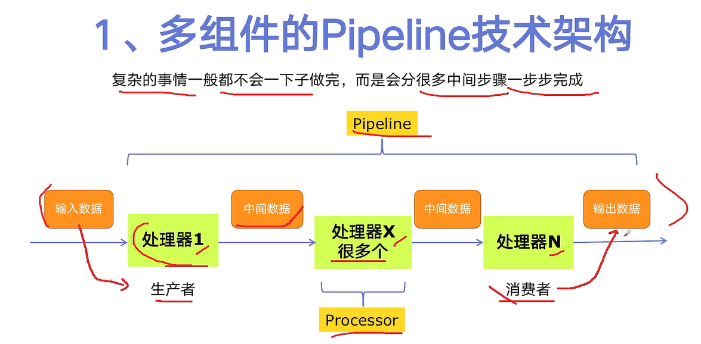
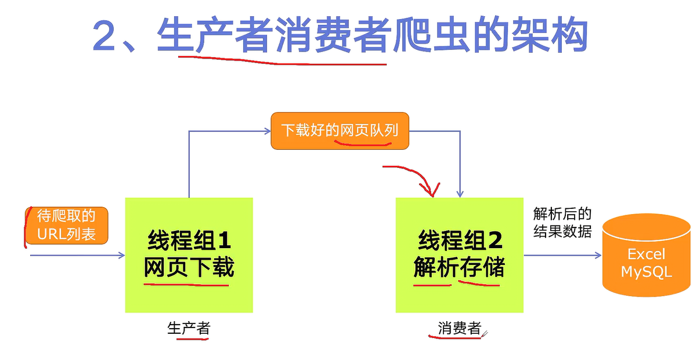
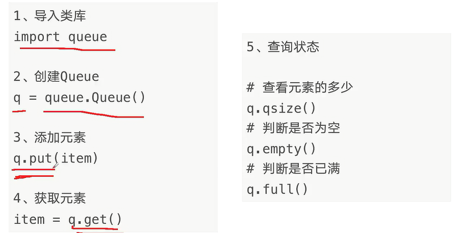
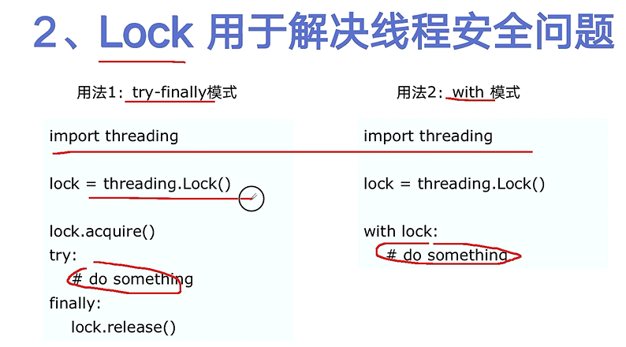
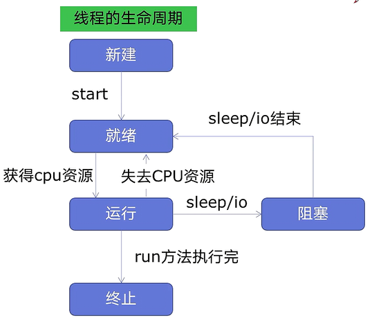
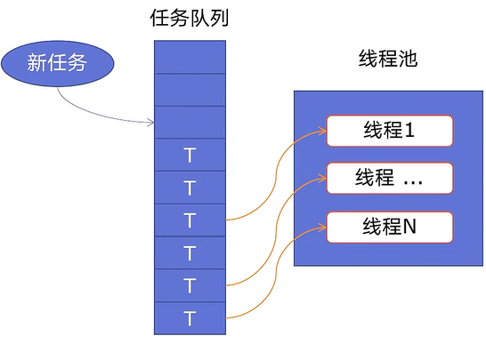
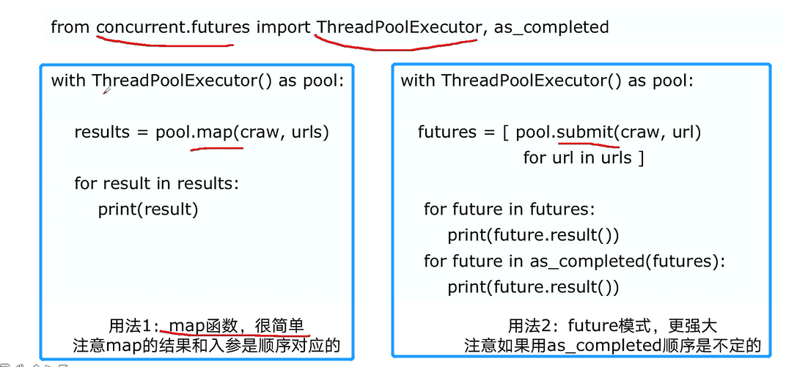
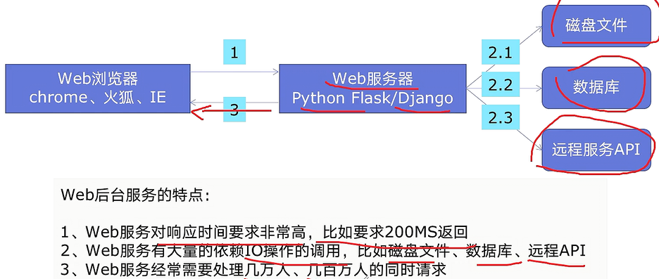
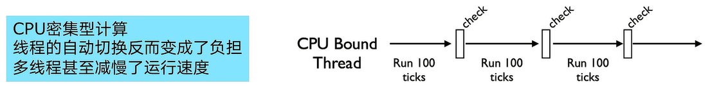
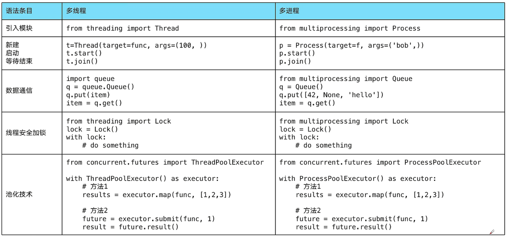

# multiTasking

Python多任务

##### 1. 基础结构

+ 多组件Pipeline架构
  

+ 生产者消费者架构
  

+ 多线程数据通信 `queue.Queue`
    + 用于多线程之间的**线程安全**(数据不会发生冲突)的数据通信
    + 简单版
      

##### 2. 多线程

+ 线程安全
    + 某个函数、函数库在多线程环境中被调用时，能够正确地处理多个线程之间的共享变量，使程序功能正确完成
    + 实现方法
      

+ 线程的生命周期
    + 

+ 线程池
    + 线程的新建和终止都需要额外的开销（分配/回收资源）,如果可以重用线程，则可以省去分配、回收的开销。 线程池就应需而生了

    + 优点
        + 提升性能：因为省去了大量的分配、回收开销，重用线程资源
        + 防御功能：能有效避免系统因为创建线程过多，而导致系统负荷过大而响应变慢的问题
        + 代码优势：使用线程池的语法比自己新建线程执行线程更加简洁

    + 适用场景
        + 适合处理突发性大量请求或需要大量线程完成任务、但实际任务处理时间较短

    + 原理图
      

    + 用法样例
      

    + `as_completed`
        + 一个生成器，在没有任务完成的时候，会阻塞
        + 在有某个任务完成的时候，会yield这个任务，就能执行for循环下面的语句，然后继续阻塞住，循环到所有的任务结束
        + 先完成的任务会先通知主线程

    + 线程池加速 web服务
        + 方便将磁盘文件、数据库、远程`API`的`IO`调用并发执行
        + 线程池的线程数目不会无限创建(导致系统挂掉)，具有防御功能
          

##### 3.多进程

+ `multiprocessing`模块
+ 
+ 语法和多线程几乎一模一样
  

##### 4.协程

##### 5.资料相关

+ [B站UP 蚂蚁学Python](https://www.bilibili.com/video/BV1bK411A7tV?from=search&seid=10435659050354918202)